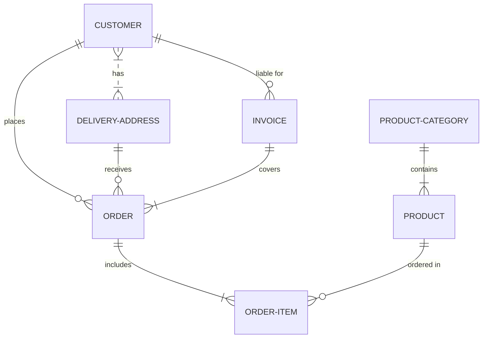

# memariad
[github memariad](https://github.com/mermaid-js/mermaid)
[mermaid-js website](http://mermaid-js.github.io/mermaid/#/)
[article on github memariad](https://github.blog/2022-02-14-include-diagrams-markdown-files-mermaid/)

